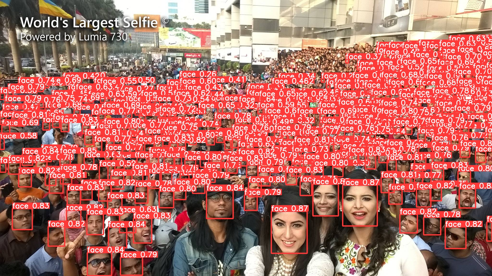

<h1 align="center"><span>YOLOv9 for Face Detection</span></h1>

This repository demonstrates how to train and deploy a YOLOv9 model for highly accurate face detection in both images and videos. Using the WIDER Face dataset, the model has been fine-tuned to detect human faces with high precision, making it suitable for a variety of applications such as security systems, face tracking, and more.  

<p align="center" margin: 0 auto;>
  
</p>


## ⚙️ Installation
Clone this repo and install [requirements.txt](https://github.com/spacewalk01/yolov9-face-detection/blob/main/yolov9/requirements.txt) for YOLOv9:
```
git clone https://github.com/Elmaqoo/face_detection_yolov9

Suggested Using Docker environment (recommended)
python -m venv venv
venv\Scripts\activate

cd face_detection_yolov9/yolov9
pip install -r requirements.txt
Download and install CUDA 12.4 (https://developer.nvidia.com/cuda-12-4-0-download-archive)
Download and install CUDNN 9.6 (https://developer.nvidia.com/cudnn-downloads)
pip3 install torch torchvision torchaudio --index-url https://download.pytorch.org/whl/cu124
```

## 🤖 Pretrained Model

Download the pretrained `yolov9-c.pt` model from [google drive](https://drive.google.com/file/d/15K4e08lcZiiQrXmdsnm2BhcoNS3MOMmx/view?usp=sharing). Note that this model was trained on the WIDER dataset for 240 epochs.

## 📚 Data Preparation

The WIDER dataset comprises of more than 30k images with more than 390k faces, each with bouding box and other various label formats.

**Dataset structure**
```
${ROOT}
└── assets
    └── video
    └── images
└── yolov9
└── datasets/    
    └── widerface/
        └── train/
        └── val/
    └── original-widerface/
        └── train/
            └── images/
            └── label.txt
        └── val/
            └── images/
            └── label.txt
└── train2yolo.py
└── val2yolo.py
└── widerface.yaml
└── best.pt
```

To prepare the data:

1. Download the [WIDER-FACE](http://shuoyang1213.me/WIDERFACE) datasets.
2. Download the annotation files from [google drive](https://drive.google.com/file/d/1tU_IjyOwGQfGNUvZGwWWM4SwxKp2PUQ8/view?usp=sharing).

Run the following commands:

```shell
python train2yolo.py datasets/original-widerface/train datasets/widerface/train
python val2yolo.py datasets/original-widerface datasets/widerface/val
```

These scripts will convert your annotation files to YOLO format, creating one .txt file per image. Each row in the file will represent a single object in the format: `class x_center y_center width height`.

## 🏋️ Training

To train the model, use the following command:

``` shell
cd yolov9
python train_dual.py --workers 4 --device 0 --batch 4 --data ../widerface.yaml --img 640 --cfg models/detect/yolov9-c.yaml --weights '' --name yolov9-c --hyp hyp.scratch-high.yaml --min-items 0 --epochs 500 --close-mosaic 15
```

## 🌱 Inference

For inference, run the following command:

``` shell
python detect.py --weights runs/train/yolov9-c5/weights/best.pt --source ../assets/worlds-largest-selfie.jpg
```

Or if you want to use the trained model, download it from the above link and run the following command:

``` shell
# For single image inference
python detect.py --weights ../best.pt --source ../assets/worlds-largest-selfie.jpg
# For bulk image processing
python detect.py --weights ../best.pt --source ../assets/images/ 
# For video processing
python detect_video.py --weights ../best.pt --source ../assets/video/test_1.mp4 
```

## 🔗 Reference
* [YOLOv9](https://github.com/WongKinYiu/yolov9) - YOLOv9: Learning What You Want to Learn Using Programmable Gradient Information
* [WIDER FACE](http://shuoyang1213.me/WIDERFACE) - WIDER FACE: A Face Detection Benchmark
* [YOLO5Face](https://github.com/deepcam-cn/yolov5-face) - YOLO5Face: Why Reinventing a Face Detector
* [YOLO9 Face Detection](https://github.com/spacewalk01/yolov9-face-detection/) - YOLO9 Face Detection

